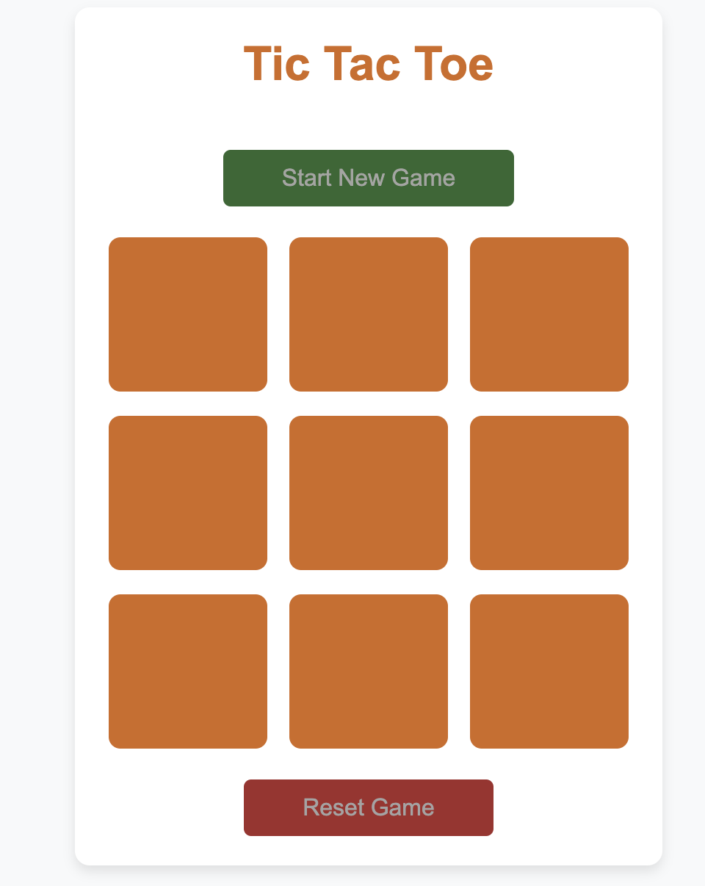
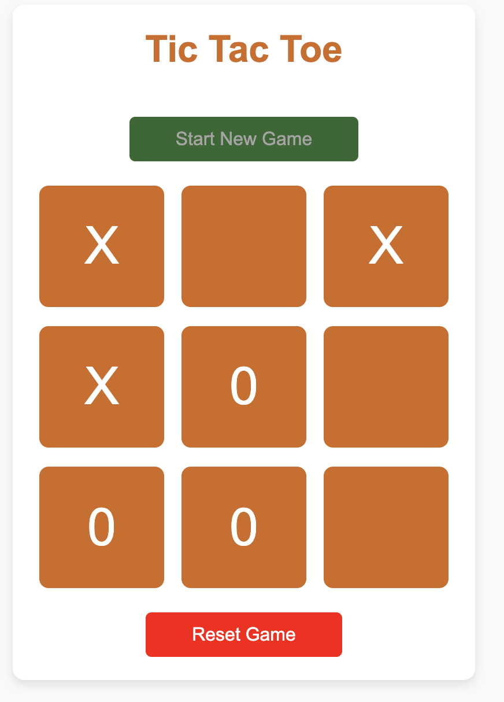
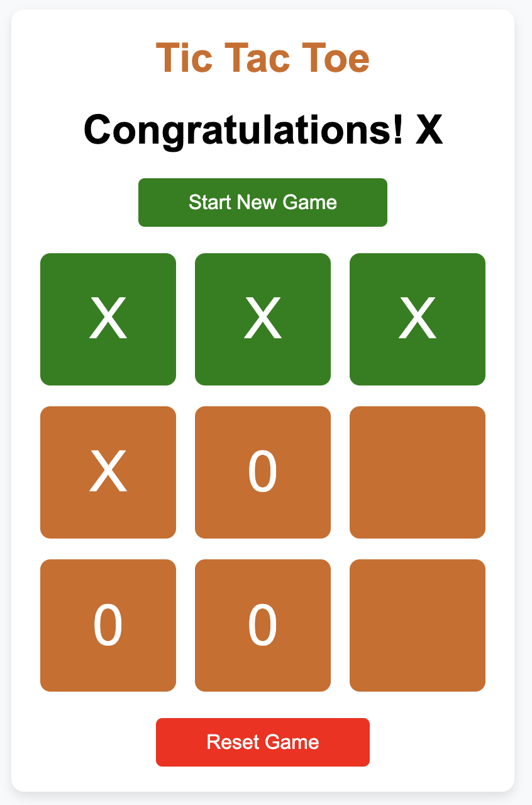

# Tic Tac Toe Game

A fun and interactive **Tic Tac Toe** game built with **HTML**, **CSS**, and **JavaScript**. The game is designed to be responsive and visually appealing, offering an enjoyable experience on both desktop and mobile devices.

## 🎮 Features

- **Player vs Player Gameplay**: Take turns marking the cells to achieve a winning combination.
- **Winner Announcement**: Displays the winner at the end of the game or indicates a draw if no winner is found.
- **Interactive Buttons**: Includes options to reset the game or start a new one.
- **Responsive Design**: Optimized for various screen sizes and devices.
- **Hover Effects**: Engaging hover effects for better user interaction.

## 🖼️ Screenshots

*(Add screenshots of your game interface here if available)*

## 🛠️ Technologies Used

- **HTML**: For the game structure.
- **CSS**: For styling and responsiveness.
- **JavaScript**: For game logic and interactivity.

## 🚀 Getting Started

### Prerequisites
To run this project, you need a modern web browser.

### Installation
1. Clone this repository or download the zip file:
   ```bash
   git clone https://github.com/your-username/tic-tac-toe.git


To add screenshots of your Tic Tac Toe game to the README.md, follow these steps:

1. Prepare Your Screenshots
Capture screenshots of your game in action.
Save them in a folder named screenshots in your project directory.
Name the screenshots descriptively (e.g., game-start.png, game-win.png, etc.).
2. Update the README.md
Embed the screenshots using Markdown syntax like this:

markdown
Copy code
## 🖼️ Screenshots

### Game Start


### Player Move


### Winner Announced
